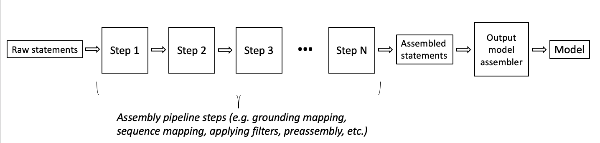

# INDRA

[](https://opensource.org/licenses/BSD-2-Clause)
[](https://travis-ci.com/sorgerlab/indra)
[](https://indra.readthedocs.io/en/latest/?badge=latest)
[](https://badge.fury.io/py/indra)
[](https://www.python.org/downloads/release/python-357/)


INDRA (Integrated Network and Dynamical Reasoning Assembler) is an automated
model assembly system, originally developed for molecular systems biology and
currently being generalized to other domains. INDRA draws on natural language
processing systems and structured databases to collect mechanistic and causal
assertions, represents them in a standardized form (INDRA Statements), and
assembles them into various modeling formalisms including causal graphs and
dynamical models.

At the core of INDRA are its knowledge-level assembly procedures, allowing
sources to be assembled into coherent models, a process that involves
correcting systematic input errors, finding and resolving redundancies,
inferring missing information, filtering to a relevant scope and assessing the
reliability of causal information.

The detailed INDRA documentation is available at
[http://indra.readthedocs.io](http://indra.readthedocs.io).

## Contents

- [INDRA Modules](#indra-modules)
    - [Knowledge sources](#knowledge-sources)
    - [Output model assemblers](#output-model-assemblers)
    - [Internal knowledge assembly](#internal-knowledge-assembly)
    - [Other modules](#other-modules)
- [Citation](#citation)
- [Installation](#installation)
- [INDRA REST API](#indra-rest-api)
- [INDRA Docker](#indra-docker)
- [Using INDRA](#using-indra)
- [Funding](#funding)

## INDRA Modules

### Knowledge sources

INDRA is currently integrated with the following natural language processing
systems and structured databases. These input modules (available in
`indra.sources`) all produce INDRA Statements.

General purpose causal relation reading systems:

| Reader     | Module                | Reference                                 |
|------------|-----------------------|-------------------------------------------|
| Eidos      | [`indra.sources.eidos`](https://indra.readthedocs.io/en/latest/modules/sources/eidos/index.html#) | https://github.com/clulab/eidos           |
| TRIPS/CWMS | [`indra.sources.cwms`](https://indra.readthedocs.io/en/latest/modules/sources/cwms/index.html#)  | http://trips.ihmc.us/parser/cgi/cwmsreader|
| Hume       | [`indra.sources.hume`](https://indra.readthedocs.io/en/latest/modules/sources/hume/index.html)  | https://github.com/BBN-E/Hume             |
| Sofia      | [`indra.sources.sofia`](https://indra.readthedocs.io/en/latest/modules/sources/sofia/index.html) | https://sofia.worldmodelers.com/ui/       |

Biology-oriented reading systems:

| Reader     | Module                  | Reference                                       |
|------------|-------------------------|-------------------------------------------------|
| TRIPS/DRUM | [`indra.sources.trips`](https://indra.readthedocs.io/en/latest/modules/sources/trips/index.html)   | http://trips.ihmc.us/parser/cgi/drum            |
| REACH      | [`indra.sources.reach`](https://indra.readthedocs.io/en/latest/modules/sources/reach/index.html)   | https://github.com/clulab/reach                 |
| Sparser    | [`indra.sources.sparser`](https://indra.readthedocs.io/en/latest/modules/sources/sparser/index.html#) | https://github.com/ddmcdonald/sparser           |
| TEES       | [`indra.sources.tees`](https://indra.readthedocs.io/en/latest/modules/sources/tees/index.html)   | https://github.com/jbjorne/TEES                 |
| MedScan    | [`indra.sources.medscan`](https://indra.readthedocs.io/en/latest/modules/sources/medscan/index.html) | https://doi.org/10.1093/bioinformatics/btg207   |
| RLIMS-P    | [`indra.sources.rlimsp`](https://indra.readthedocs.io/en/latest/modules/sources/rlimsp/index.html)  | https://research.bioinformatics.udel.edu/rlimsp |
| ISI/AMR    | [`indra.sources.isi`](https://indra.readthedocs.io/en/latest/modules/sources/isi/index.html)     | https://github.com/sgarg87/big_mech_isi_gg      |
| Geneways   | [`indra.sources.geneways`](https://indra.readthedocs.io/en/latest/modules/sources/geneways/index.html) | https://www.ncbi.nlm.nih.gov/pubmed/15016385    |

Biological pathway databases:

| Database / Exchange format | Module                     | Reference                                                       |
|----------------------------|----------------------------|-----------------------------------------------------------------|
| PathwayCommons / BioPax    | [`indra.sources.biopax`](https://indra.readthedocs.io/en/latest/modules/sources/biopax/index.html)     | http://pathwaycommons.org/ <br/> http://www.biopax.org/         |
| Large Corpus / BEL         | [`indra.sources.bel`](https://indra.readthedocs.io/en/latest/modules/sources/bel/index.html)        | https://github.com/pybel/pybel <br/> https://github.com/OpenBEL |
| Signor                     | [`indra.sources.signor`](https://indra.readthedocs.io/en/latest/modules/sources/signor/index.html)     | https://signor.uniroma2.it/                                     |
| BioGRID                    | [`indra.sources.biogrid`](https://indra.readthedocs.io/en/latest/modules/sources/biogrid/index.html)    | https://thebiogrid.org/                                         |
| Target Affinity Spectrum   | [`indra.sources.tas`](https://indra.readthedocs.io/en/latest/modules/sources/tas/index.html#)        | https://doi.org/10.1101/358978                                  |
| LINCS small molecules      | [`indra.sources.lincs_drug`](https://indra.readthedocs.io/en/latest/modules/sources/lincs_drug/index.html) | http://lincs.hms.harvard.edu/db/sm/                             |
| HPRD                       | [`indra.sources.hprd`](https://indra.readthedocs.io/en/latest/modules/sources/hprd/index.html) | http://www.hprd.org          |                   |
| TRRUST                     | [`indra.sources.trrust`](https://indra.readthedocs.io/en/latest/modules/sources/trrust.html) | https://www.grnpedia.org/trrust/          |                   |
| Phospho.ELM                | [`indra.sources.phosphoelm`](https://indra.readthedocs.io/en/latest/modules/sources/phosphoelm/index.html) | http://phospho.elm.eu.org/ |
| VirHostNet                | [`indra.sources.virhostnet`](https://indra.readthedocs.io/en/latest/modules/sources/virhostnet/index.html) | http://virhostnet.prabi.fr/ |
| CTD                  | [`indra.sources.ctd`](https://indra.readthedocs.io/en/latest/modules/sources/ctd/index.html) | http://ctdbase.org |
| DrugBank                  | [`indra.sources.drugbank`](https://indra.readthedocs.io/en/latest/modules/sources/drugbank/index.html) | https://www.drugbank.ca/ |
| OmniPath                  | [`indra.sources.omnipath`](https://indra.readthedocs.io/en/latest/modules/sources/omnipath/index.html) | https://omnipathdb.org/ |


Custom knowledge bases:

| Database / Exchange format | Module                        | Reference                            |
|----------------------------|-------------------------------|--------------------------------------|
| NDEx / CX                  | [`indra.sources.ndex_cx`](https://indra.readthedocs.io/en/latest/modules/sources/ndex_cx/index.html)       | http://ndexbio.org                   |
| INDRA DB / INDRA Statements| [`indra.sources.indra_db_rest`](https://indra.readthedocs.io/en/latest/modules/sources/indra_db_rest/index.html) | https://github.com/indralab/indra_db |
| Hypothes.is                  | [`indra.sources.hypothesis`](https://indra.readthedocs.io/en/latest/modules/sources/hypothesis/index.html)       | https://hypothes.is                   |
| Biofactoid                  | [`indra.sources.biofactoid`](https://indra.readthedocs.io/en/latest/modules/sources/biofactoid/index.html)       | https://biofactoid.org/                   |


### Output model assemblers

INDRA also provides several model output assemblers that take INDRA Statements
as input. The most sophisticated model assembler is the PySB Assembler, which
implements a policy-guided automated assembly procedure of a rule-based
executable model (that can then be further compiled into other formats such as
SBML, Kappa, BNGL and SBGN to connect to a vast ecosystem of downstream tools).
Several other model assembly modules target various network formats for
visualization, and graph/structural analysis (PyBEL, CyJS, Graphviz, SBGN,
CX, SIF, etc.) and curation (HTML, TSV, IndexCards).
Finally, the English Assembler produces English language descriptions of a set
of INDRA Statements.

INDRA also supports extension by outside model assembly tools which take
INDRA Statements as input and produce models. One such example is Delphi
(https://github.com/ml4ai/delphi), which is a Dynamic Bayesian Network
model assembler. Similarly, outside tools that support INDRA Statements
can implement custom visualization methods, such as CauseMos, developed
by Uncharted Software (https://uncharted.software/).

Assemblers aimed at model-driven discovery and analysis:

| Modeling formalism / Exchange format           | Purpose                                              | Module                  | Reference           |
|------------------------------------------------|------------------------------------------------------|-------------------------|---------------------|
| PySB (-> SBML, SBGN, BNGL, Kappa, etc.)        | Detailed, mechanistic modeling, simulation, analysis | [`indra.assemblers.pysb`](https://indra.readthedocs.io/en/latest/modules/assemblers/pysb_assembler.html#) | http://pysb.org     |
| PyBEL                                          | Causal analysis, visualization                       | [`indra.assemblers.pybel`](https://indra.readthedocs.io/en/latest/modules/assemblers/pybel_assembler.html)| https://github.com/pybel/pybel <br/> https://bel-commons.scai.fraunhofer.de/ |
| IndraNet                                       | Causal analysis, signed and unsigned                 | [`indra.assemblers.indranet`](https://indra.readthedocs.io/en/latest/modules/assemblers/indranet_assembler.html) |                  |
| SIF                                            | Network analysis, logic modeling, visualization      | [`indra.assemblers.sif`](https://indra.readthedocs.io/en/latest/modules/assemblers/sif_assembler.html)  | [SIF format](http://manual.cytoscape.org/en/stable/Supported_Network_File_Formats.html#sif-format) |
| Figaro                                         | Bayesian network inference                           | `indra.assemblers.figaro` | https://github.com/p2t2/figaro/ |
| KAMI                                           | Knowledge aggregation of protein sites/states and Kappa modeling | [`indra.assemblers.kami`](https://indra.readthedocs.io/en/latest/modules/assemblers/kami_assembler.html) | https://github.com/Kappa-Dev/KAMI |


Assemblers primarily aimed at visualization:

| Network / Exchange format                      | Purpose                                              | Module                  | Reference           |
|------------------------------------------------|------------------------------------------------------|-------------------------|---------------------|
| Causal Analysis Graph                          | General causal graph visualization                   | [`indra.assemblers.cag`](https://indra.readthedocs.io/en/latest/modules/assemblers/cag_assembler.html)  |                     |
| CX                                             | Network browsing, versioning on NDEx                 | [`indra.assemblers.cx`](https://indra.readthedocs.io/en/latest/modules/assemblers/cx_assembler.html)   | http://ndexbio.org  |
| Cytoscape JS                                   | Interactive Cytoscape JS network to embed in websites| [`indra.assemblers.cyjs`](https://indra.readthedocs.io/en/latest/modules/assemblers/cyjs_assembler.html) | http://js.cytoscape.org/ |
| Graphviz                                       | Static PDF/PNG visualization with powerful automated layout using Graphviz | [`indra.assemblers.graph`](https://indra.readthedocs.io/en/latest/modules/assemblers/graph_assembler.html) | https://www.graphviz.org/ |
| SBGN                                           | Visualization with Systems Biology Graphical Notation| [`indra.assemblers.sbgn`](https://indra.readthedocs.io/en/latest/modules/assemblers/sbgn_assembler.html) | http://sbgn.org     |

Assemblers primarily aimed at expert curation and browsing:

| Output format                                  | Purpose                                                | Module                  | Reference           |
|------------------------------------------------|------------------------------------------------------  |-------------------------|---------------------|
| English language                               | Human-readable descriptions, reports, dialogue         | [`indra.assemblers.english`](https://indra.readthedocs.io/en/latest/modules/assemblers/english_assembler.html) |                  |
| HTML                                           | Web-based browsing, linking out to provenance, curation| [`indra.assemblers.html`](https://indra.readthedocs.io/en/latest/modules/assemblers/html_assembler.html) | [Curation tutorial](https://indra.readthedocs.io/en/latest/tutorials/html_curation.html) |
| TSV (Tab/Comma Separated Values)               | Spreadsheet-based browsing and curation                | [`indra.assemblers.tsv`](https://indra.readthedocs.io/en/latest/modules/assemblers/tsv_assembler.html)  |                     |
| Index Cards                                    | Custom JSON format for curating biological mechanisms  | [`indra.assemblers.index_card`](https://indra.readthedocs.io/en/latest/modules/assemblers/index_card_assembler.html) |               |

### Internal knowledge assembly

A key feature of INDRA is providing internal knowledge-assembly modules
that operate on INDRA Statements and perform the following tasks:
- Redundancy/subsumption/generalization/contradiction finding and resolution
with respect to an ontology with the Preassembler
([`indra.preassembler.Preassembler`](https://indra.readthedocs.io/en/latest/modules/preassembler/index.html#module-indra.preassembler))
- Belief calculation based on evidence using the BeliefEngine
([`indra.belief`](https://indra.readthedocs.io/en/latest/modules/belief/index.html))
- Mapping grounding between multiple ontologies
([`indra.preassembler.ont_mapper.OntMapper`](https://indra.readthedocs.io/en/latest/modules/preassembler/index.html#module-indra.preassembler.ontology_mapper))
- Grounding override and disambiguation
([`indra.preassembler.grounding_mapper.GroundingMapper`](https://indra.readthedocs.io/en/latest/modules/preassembler/index.html#module-indra.preassembler.grounding_mapper))
- Protein sequence mapping ([`indra.preassembler.site_mapper.SiteMapper`](https://indra.readthedocs.io/en/latest/modules/preassembler/index.html#module-indra.preassembler.sitemapper))

The internal assembly steps of INDRA including the ones listed above, and also
a large collection of filters (filter by source, belief, the presence of
grounding information, semantic filters by entity role, etc.) are exposed
in the
[indra.tools.assemble_corpus](http://indra.readthedocs.io/en/latest/modules/tools/index.html#module-indra.tools.assemble_corpus) 
submodule. This submodule contains functions that
take Statements as input and produce processed Statements as output. They can
be composed to form an assembly pipeline connecting knowledge collected from
sources with an output model.

This diagram illustrates the assembly pipeline process.



The choice of assembly functions can vary depending on the domain (i.e,
biology or world modeling), the modeling goal (i.e., the type of model that
will be assembled and how that model will be used), desired features, and
confidence (e.g., filter to human genes only or apply a belief cutoff),
and any other user preferences.

An example of a typical assembly pipeline for biology statements is as follows.
Some of the below steps can be removed, rearranged, and other steps added
to change the assembly pipeline.

[//]: # (If code is changed here, also update it in tests/test_docs_code.py)

```python
from indra.tools import assemble_corpus as ac
stmts = <the collection of all raw statements to use>
stmts = ac.filter_no_hypothesis(stmts)  # Filter out hypothetical statements
stmts = ac.map_grounding(stmts)         # Map grounding
stmts = ac.filter_grounded_only(stmts)  # Filter out ungrounded agents
stmts = ac.filter_human_only(stmts)     # Filter out non-human genes
stmts = ac.map_sequence(stmts)          # Map sequence
stmts = ac.run_preassembly(stmts,       # Run preassembly
                           return_toplevel=False)
stmts = ac.filter_belief(stmts, 0.8)    # Apply belief cutoff of 0.8
```

An example of an assembly pipeline for statements in the world modeling domain
is as follows (note how biology-specific functions are not used, and a custom
belief_scorer and ontology is passed to `run_preassembly` here, while the
biology pipeline used default values):

[//]: # (If code is changed here, also update it in tests/test_docs_code.py)

```python
from indra.tools import assemble_corpus as ac
from indra.belief.wm_scorer import get_eidos_scorer
from indra.ontology.world import world_ontology
stmts = <the collection of all raw statements to use>
stmts = ac.filter_grounded_only(stmts)  # Filter out ungrounded agents
belief_scorer = get_eidos_scorer()
stmts = ac.run_preassembly(stmts,       # Run preassembly
                           return_toplevel=False,
                           belief_scorer=belief_scorer,
                           ontology=world_ontology,
                           normalize_equivalences=True,     # Optional: rewrite equivalent groundings to one standard
                           normalize_opposites=True,        # Optional: rewrite opposite groundings to one standard
                           normalize_ns='WM')               # Use 'WM' namespace to normalize equivalences and opposites 
stmts = ac.filter_belief(stmts, 0.8)    # Apply belief cutoff of e.g., 0.8
```
Assembled statements returned after running the assembly pipeline can be
passed into any of the output model assemblers.

### Other modules

INDRA also contains modules to access literature content (e.g., PubMed, Elsevier), available in [`indra.literature`](
https://indra.readthedocs.io/en/latest/modules/literature/index.html), and 
access ontological information and convert between identifiers (e.g., UniProt, 
HGNC), available in [`indra.databases`](
https://indra.readthedocs.io/en/latest/modules/databases/index.html).
A full list of further INDRA modules is available in the [`documentation`](
https://indra.readthedocs.io/en/latest/modules/index.html).

## Citation

Gyori B.M., Bachman J.A., Subramanian K., Muhlich J.L., Galescu L., Sorger P.K.
[From word models to executable models of signaling networks using automated
assembly](http://msb.embopress.org/content/13/11/954) (2017),
Molecular Systems Biology, 13, 954.

## Installation

For detailed installation instructions,
[see the documentation](http://indra.readthedocs.io/en/latest/installation.html).

INDRA currently supports Python 3.6+. The last release of INDRA compatible
with Python 2.7 is 1.10, and the last release fully compatible with Python 3.5
is 1.17.

The preferred way to install INDRA is by pointing pip to the source repository
as

    $ pip install git+https://github.com/sorgerlab/indra.git

Releases of INDRA are also available on
[PyPI](https://pip.pypa.io/en/latest/installing/), you can install the latest
release as

    $ pip install indra

However, releases will usually be behind the latest code available in this
repository.

INDRA depends on a few standard Python packages. These packages are installed
by pip during setup.
For certain modules and use cases, other "extra" dependencies may be needed,
which are described in detail in the
[documentation](http://indra.readthedocs.io/en/latest/installation.html).


## INDRA REST API
A REST API for INDRA is available at http://api.indra.bio:8000.
Note that the REST API is ideal for prototyping and for building light-weight
web apps, but should not be used for large reading and assembly workflows.


## INDRA Docker
INDRA is available as a Docker image on Dockerhub and can be pulled as

```
docker pull labsyspharm/indra
```

You can run the INDRA REST API using the container as
```
docker run -id -p 8080:8080 --entrypoint python labsyspharm/indra /sw/indra/rest_api/api.py
```

To build the image locally, there are currently two Dockerfiles for
INDRA and its dependencies. They are available in the following repositories:
- https://github.com/indralab/indra_docker
- https://github.com/indralab/indra_deps_docker

## Using INDRA

In this example INDRA assembles a PySB model from the natural language
description of a mechanism via the [TRIPS reading web
service](http://trips.ihmc.us/parser/cgi/drum).

[//]: # (If code is changed here, also update it in tests/test_docs_code.py)

```python
from indra.sources import trips
from indra.assemblers.pysb import PysbAssembler
pa = PysbAssembler()
# Process a natural language description of a mechanism
trips_processor = trips.process_text('MEK2 phosphorylates ERK1 at Thr-202 and Tyr-204')
# Collect extracted mechanisms in PysbAssembler
pa.add_statements(trips_processor.statements)
# Assemble the model
model = pa.make_model(policies='two_step')
```

INDRA also provides an interface for the
[REACH](http://github.com/clulab/reach) natural language
processor. In this example, a full paper from [PubMed
Central](http://www.ncbi.nlm.nih.gov/pmc/) is processed. The paper's PMC ID is
[PMC3717945](http://www.ncbi.nlm.nih.gov/pmc/articles/PMC3717945/). The example
assumest that a REACH server is running locally (see documentation at
[`indra.sources.reach`](https://indra.readthedocs.io/en/latest/modules/sources/reach/index.html)).
Note that REACH takes about 8 minutes to read this full-text paper.


[//]: # (If code is changed here, also update it in tests/test_docs_code.py)

```python
from indra.sources import reach
reach_processor = reach.process_pmc('PMC3717945', url=reach.local_nxml_url)
```
At this point, `reach_processor.statements` contains a list of INDRA statements
extracted from the PMC paper.

Next we look at an example of reading the 10 most recent PubMed abstracts on
BRAF and collecting the results in INDRA statements.

[//]: # (If code is changed here, also update it in tests/test_docs_code.py)

```python
from indra.sources import reach
from indra.literature import pubmed_client
# Search for 10 most recent abstracts in PubMed on 'BRAF'
pmids = pubmed_client.get_ids('BRAF', retmax=10)
all_statements = []
for pmid in pmids:
    abs = pubmed_client.get_abstract(pmid)
    if abs is not None:
        reach_processor = reach.process_text(abs, url=reach.local_text_url)
        if reach_processor is not None:
            all_statements += reach_processor.statements
```
At this point, the `all_statements` list contains all the statements
extracted from the 10 abstracts.

The next example shows querying the [BEL large
corpus](https://github.com/cthoyt/selventa-knowledge)
network for a neighborhood of a given list of proteins using their
HGNC gene names. This example performs the query via PyBEL.

[//]: # (If code is changed here, also update it in tests/test_docs_code.py)

```python
from indra.sources import bel
# Process the neighborhood of BRAF and MAP2K1
bel_processor = bel.process_pybel_neighborhood(['BRAF', 'MAP2K1'])
```
At this point, `bel_processor.statements` contains a list of INDRA statements
extracted from the neighborhood query.

Next, we look at an example of querying the [Pathway Commons
database](http://pathwaycommons.org) for paths between two lists of proteins.

[//]: # (If code is changed here, also update it in tests/test_docs_code.py)

```python
from indra.sources import biopax
# Process the neighborhood of BRAF and MAP2K1
biopax_processor = biopax.process_pc_pathsfromto(['BRAF', 'RAF1'], ['MAP2K1', 'MAP2K2'])
```
At this point, `biopax_processor.statements` contains a list of INDRA 
Statements extracted from the paths-from-to query.

## Funding

The development of INDRA has been funded from the following sources:

| Program                                          | Grant number         |
|--------------------------------------------------|----------------------|
| DARPA Big Mechanism                              | W911NF-14-1-0397     |
| DARPA World Modelers                             | W911NF-18-1-0014     |
| DARPA Communicating with Computers               | W911NF-15-1-0544     |
| DARPA Automated Scientific Discovery Framework   | W911NF-18-1-0124     |
| DARPA Automating Scientific Knowledge Extraction | HR00111990009        |
| DARPA Panacea                                    | HR00111920022        |
