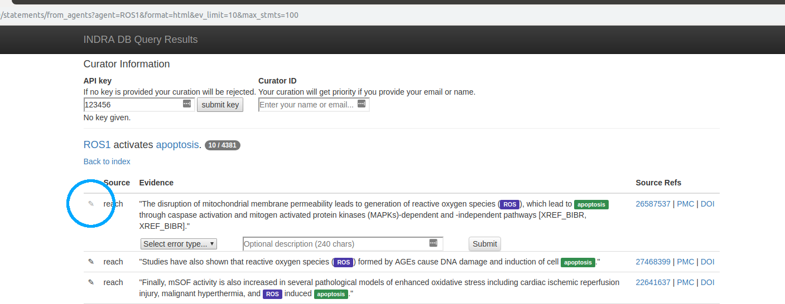
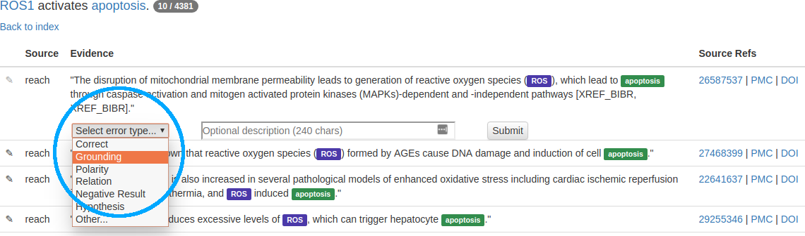
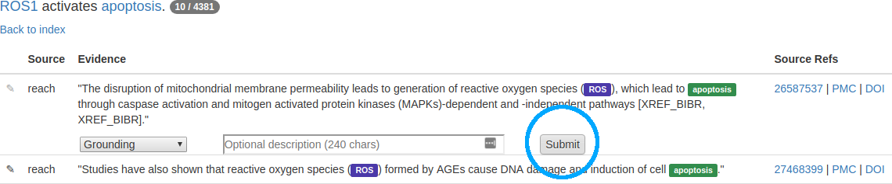
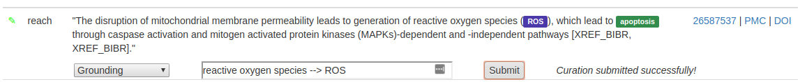
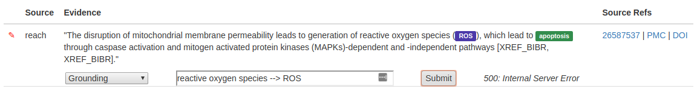

The HTML Curation Interface
======================================
Accessing the Interface
-----------------------
You will usually access this interface from any INDRA application that
exposes statements to you. However if you just want to try out the interface
or don't want to take the detour through any of the applications, you can
follow the format below to access the interface directly in your browser from
the rest API::

    http://api.host/statements/from_agents?subject=SUBJ&object=OBJ&api_key=12345&format=html

where *api.host* should be replaced with the address to the REST API service.
Entering the whole address in your browser will query for statements where
*SUBJ* is the subject and *OBJ* is the object of the statements.

For more details about the REST API, please refer to its `documentation`__.

.. _restAPIdocsHTML: https://github.com/indralab/indra_db/tree/master/rest_api/README.md#example-2

__ _restAPIdocsHTML

Curating a Statement
--------------------
Let's assume you want to check any statements were ROS1 is an agent for
errors. Let's also limit the number of statements to 100 and the number of
evidences per statements to 10. This will speed up the query and page loading.
The appropriate address to enter in your browser would then be::

    http://api.host/statements/from_agents?agent=ROS1&format=html&ev_limit=10&max_stmts=100

To start curating a statement, **click the pen icon (circled)** on the far left
side of the statement. This will produce a row below the statement with a
dropdown menu, a text box and a submit button:

The **dropdown menu** contains common errors and also the possibility to mark the
statement as 'correct'. If none of the types fit, select the *other...*
option, and describe the error with one or a few words in the provided
textbox. In our example, we see that *reactive oxygen species* is incorrectly
grounded to *ROS*, so we pick *grounding* from the drop down menu:

In the textbox, you can add a short optional description to clarify why you
marked this piece of evidence. When you are done, you can submit your curation.

Submitting a Curation
---------------------
To **submit a curation**, there are three minimum requirements:

1) A valid API key (at the top of the page)
2) A curator identifier, such as name or email (at the top of the page)
3) A selection in the dropdown menu (by the curated statement)

.. figure:: images/apikey_curatorID.png
    :align: center

When you have entered the necessary information, click the **Submit button** by
the statement that you curated:

A status message will appear once a the server has processed the submission,
indicating if the submission was successful or which problem arose if not.
The pen icon will also change color based in the returned status. **Green**
indicates a successful submission:

while a **red** indicates something went wrong with the submission:

Curation Best Practices
-----------------------
Text here.
